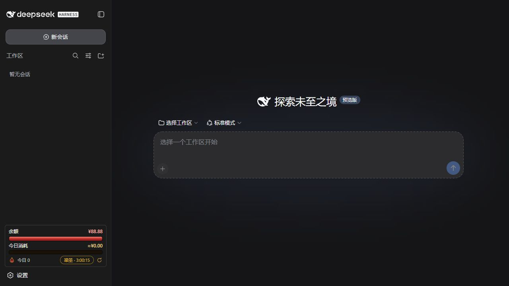
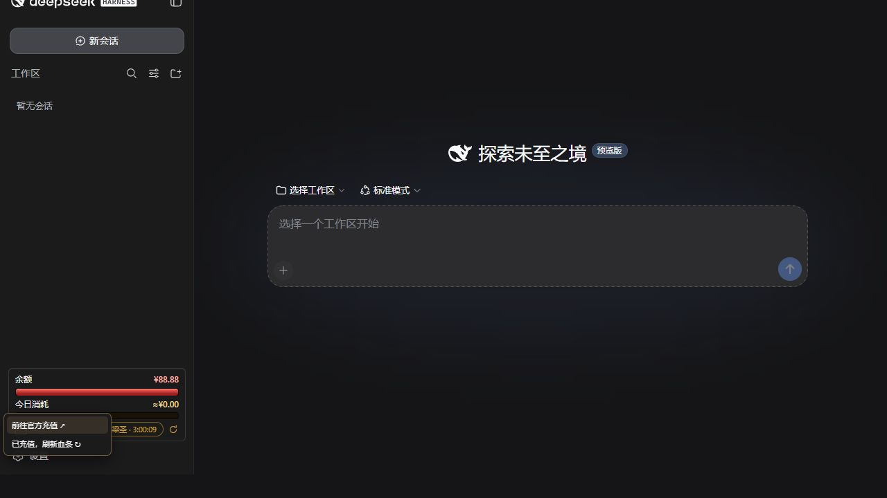
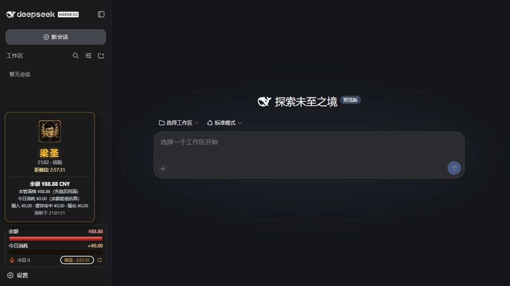

# DSH API Usage Monitor

[简体中文](./README.md) | [English](./README.en.md)

A DeepSeek Harness plugin for API balance monitoring, daily cost and token tracking, peak/off-peak pricing indicators, recharge refresh, and one-click restart. Its game-style interface turns your API balance into an HP bar and today's spend into a posture bar.

> This is an unofficial community plugin and is not affiliated with or endorsed by DeepSeek. Amounts shown in screenshots are demo data.



## Features

| Feature | What it does |
| --- | --- |
| Balance HP bar | Shows the current balance relative to the confirmed full-HP baseline. Normal spending lowers HP without unexpectedly resetting it. |
| Daily posture bar | Shows today's spend relative to the daily budget. Recharging or refreshing HP does not clear it. |
| Peak/off-peak status | Displays “Liangzi” during peak pricing and “Liangsheng” off peak. Click it for timing, balance, spend, and pricing-bucket details. |
| Recharge and refresh | The flask opens DeepSeek's official top-up page or manually refreshes the full-HP baseline after a recharge. |
| One-click restart | Restarts the current Harness from the sidebar, using a minimized supervisor on Windows and a background supervisor on macOS. |
| Persistent state | Preserves the HP baseline and today's usage state across Harness restarts. |





## Requirements

- A working DeepSeek Harness installation with `DEEPSEEK_API_KEY` already configured
- DeepSeek Harness `0.1.0-rc.6` or a compatible release
- Node.js `^22.19.0` or `>=24.0.0`
- Windows 10/11 has passed an isolated install test; macOS support is a release candidate pending real-device verification

This plugin does not install Harness or configure your API key.

## Install from GitHub

1. Download the latest `dsh-plugin-api-usage-monitor-*.tgz` from GitHub **Releases**.
2. Run the following command and replace the example with the downloaded file path:

```sh
dsh plugin --profile web add "/absolute/path/to/dsh-plugin-api-usage-monitor-1.9.0-rc.4.tgz"
```

3. Start or restart the web profile:

```sh
dsh web
```

4. Refresh the Harness page. The plugin remains installed in the `web` profile across future launches.

## Everyday use

- Click the flask to reveal **Official top-up** and **Refresh HP**.
- After recharging, click **Refresh HP**. The current balance becomes the new full-HP baseline, while the daily posture bar remains intact.
- Click **Liangzi / Liangsheng** to open the peak/off-peak card with timing, balance, spend, and pricing-bucket details.
- Click the circular arrow to restart the current Harness. The page waits for a genuinely new Harness instance before reconnecting.
- Drag the widget to detach it temporarily; double-click it to restore its default position.

## Windows and macOS

On Windows, the restart supervisor uses one minimized persistent console to prevent recurring PowerShell pop-ups. On macOS, it runs in the background and writes logs to:

```text
$DSH_HOME/logs/dsh-balance-bar-supervisor.log
```

For real-device macOS acceptance, verify installation, live balance loading, one-click restart, state persistence, and the absence of orphan processes.

## Privacy and security

- The API key is resolved by Harness on the host and is never sent to the browser.
- The plugin reads the balance directly from DeepSeek's official endpoint and sends no telemetry.
- The restart endpoint accepts only same-origin requests from the local loopback interface.
- The package contains no install scripts, API keys, conversations, or author-specific balance state.

## Uninstall

```sh
dsh plugin --profile web remove dsh-plugin-api-usage-monitor
```

Uninstalling does not remove Harness conversations. The plugin's own meter state is stored at:

```text
$DSH_HOME/storages/balance-bar-day.json
```

Stop Harness and delete that file manually only if you want a complete state reset.

## Development and verification

```sh
npm test
npm run preflight
npm pack --dry-run
```

The automated suite covers spending, manual recharge refresh, day rollover, pricing policies, duplicate restarts, crash recovery, ephemeral ports, and Windows/macOS launch behavior.

## License and artwork

Source code is released under the [MIT License](./LICENSE). Character artwork is not covered by the MIT license; see [ASSET-NOTICE.md](./ASSET-NOTICE.md).
